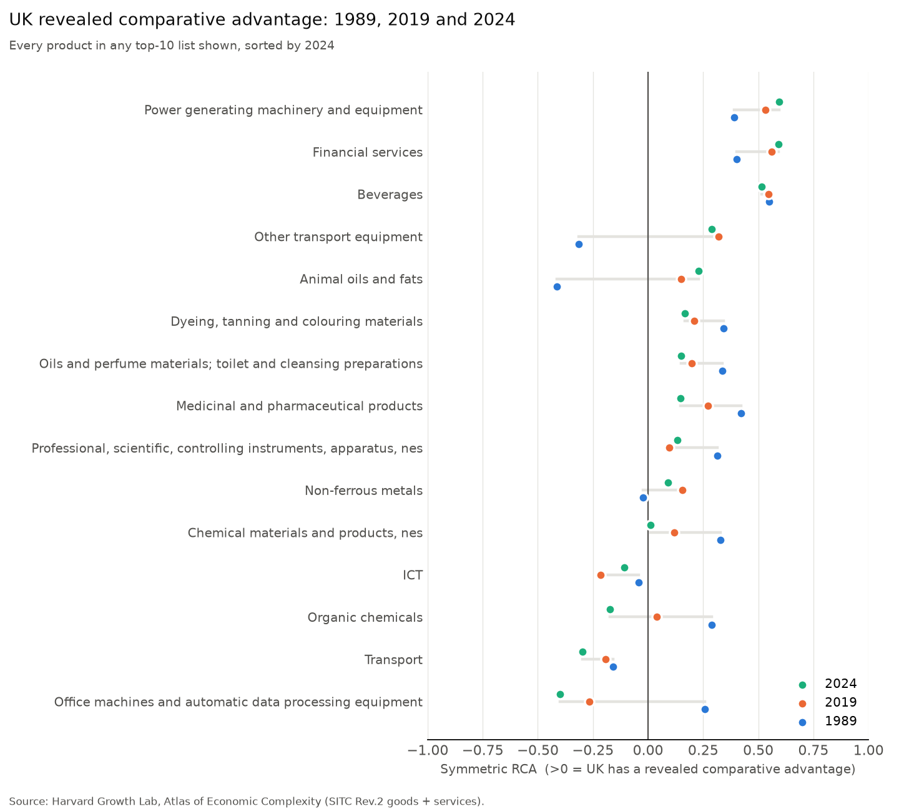
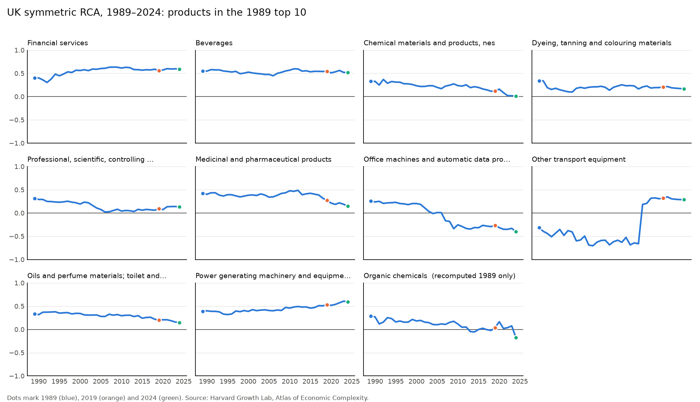
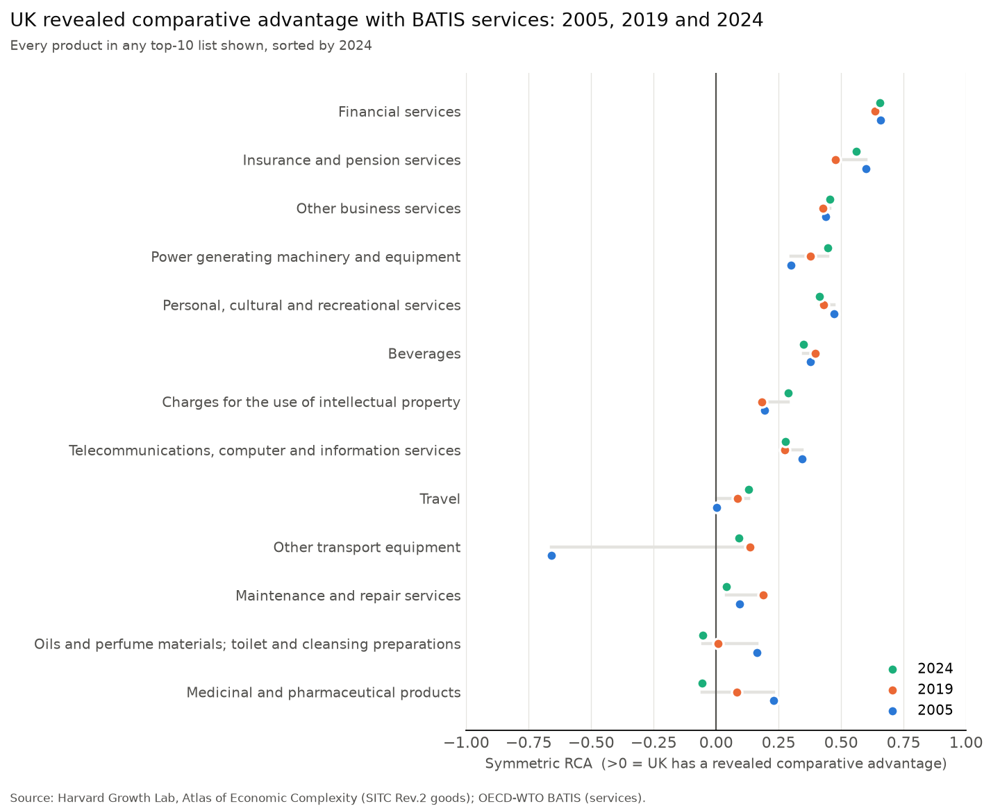
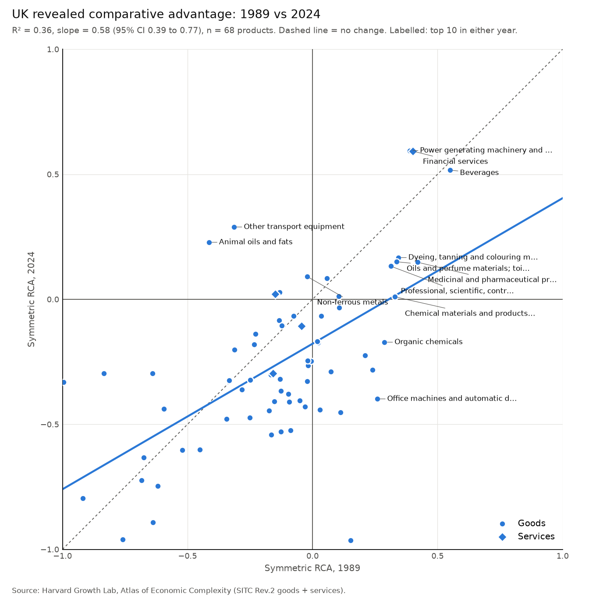
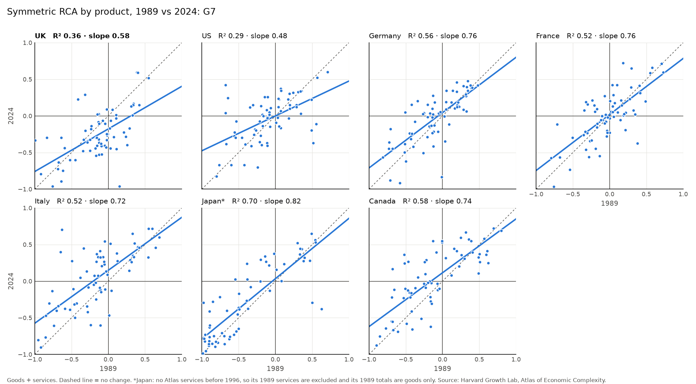
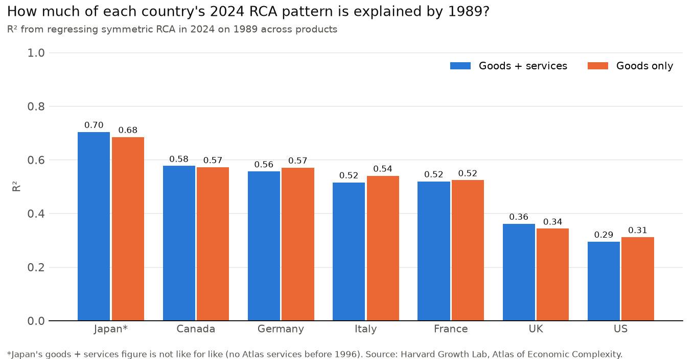

# Comparative advantage

Is the UK still specialised in the same things it was in 1989?

The Resolution Foundation's [*Enduring strengths*](https://www.resolutionfoundation.org/app/uploads/2022/04/Enduring-strengths.pdf) (April 2022, p.33) found:

> Of the top 10 products in which the UK was most specialised in 1989, seven were also in our top 10 in 2019, and the top two then – financial services and beverages – are still the top two now.

This repo recomputes that analysis with the latest data and extends it to 2024. It also adds a comparison that uses the more detailed OECD-WTO BATIS services data.

## Answer

**Mostly still true. The persistence holds, but the top two have changed.**

Main results, using the Atlas only (the report's method):

| | Published 1989 list | Recomputed 1989 list |
|---|---|---|
| Still in the 2024 top 10 | **8 of 10** | **7 of 10** |
| Dropped out | Chemical materials n.e.s.; Office machines | Chemical materials n.e.s.; Organic chemicals; Office machines |

- **Top two in 2024:** *Power generating machinery* (mainly aero engines) and *Financial services*. Beverages is now third.
- **The top spot is a near tie:** symmetric RCA is 0.595 for power generating machinery against 0.592 for financial services. In 2019 the top two were still financial services and beverages, matching the report.
- **2019 replicates closely:** 8 of the report's 10 products for 2019 are in my recomputed 2019 top 10. ICT and Transport are the two that differ (see *Data vintage* below).

UK top 10 in 2024 (Atlas only):

| Rank | Product | RCA | Symmetric RCA |
|---:|---|---:|---:|
| 1 | Power generating machinery and equipment | 3.94 | 0.595 |
| 2 | Financial services | 3.91 | 0.592 |
| 3 | Beverages | 3.14 | 0.516 |
| 4 | Other transport equipment | 1.81 | 0.289 |
| 5 | Animal oils and fats | 1.59 | 0.228 |
| 6 | Dyeing, tanning and colouring materials | 1.40 | 0.167 |
| 7 | Oils and perfume materials; toilet and cleansing preparations | 1.35 | 0.150 |
| 8 | Medicinal and pharmaceutical products | 1.35 | 0.148 |
| 9 | Professional, scientific, controlling instruments, apparatus, nes | 1.30 | 0.132 |
| 10 | Non-ferrous metals | 1.20 | 0.091 |

All the lists and the overlap counts are in [`outputs/uk_top10_comparison.md`](outputs/uk_top10_comparison.md).





### Comparison: BATIS services (2005–2024)

BATIS splits services into 12 categories rather than the Atlas's 4 broad ones. With that detail, services take 7 of the UK's 2024 top 10 places:

- **Top two:** Financial services, then Insurance and pension services.
- **Other services in the top 10:** other business services; personal, cultural and recreational services; charges for intellectual property; telecoms/computer services; travel.
- **Goods in the top 10:** power generating machinery, beverages and other transport equipment.
- **Persistence is high:** 8 of the 2005 top 10 are still in the 2024 top 10, and 9 of the 2019 top 10. The top two are the same in all three years.

BATIS starts in 2005, so this version can't test the 1989 claim directly.



## Persistence: 1989 vs 2024, UK and G7

The top 10 is sticky, but the UK's specialisation across *all* products has changed more than most of the G7.

I regressed each country's symmetric RCA in 2024 on its 1989 RCA, across all products (unweighted OLS, as in the report's Figure 14). Two exclusions:

- the volatile categories the report drops from its ranking
- any product with zero exports in either year (for a G7 economy, that's missing data rather than a real zero)

| Country | R², goods + services | Slope (95% CI) | R², goods only |
|---|---:|---|---:|
| Japan* | 0.70 | 0.82 (0.69–0.96) | 0.68 |
| Canada | 0.58 | 0.74 (0.58–0.89) | 0.57 |
| Germany | 0.56 | 0.76 (0.59–0.92) | 0.57 |
| Italy | 0.52 | 0.72 (0.55–0.90) | 0.54 |
| France | 0.52 | 0.76 (0.58–0.95) | 0.52 |
| **UK** | **0.36** | **0.58 (0.39–0.77)** | **0.34** |
| US | 0.29 | 0.48 (0.29–0.66) | 0.31 |

\*The Atlas has no Japanese services before 1996, so Japan's goods + services figure is not like for like. The goods-only column, which recomputes RCA with goods-only totals for every country, is comparable across all seven.

- **The UK is the second least persistent G7 economy.** Only the US has changed more.
- **This differs from the report**, which found the UK's persistence did not stand out among its peers (Figure 14, which compares the UK with Germany, France, the US, China and the OECD). My 2019-on-1989 slope for the UK is 0.61. In this data, Germany and France are both clearly more persistent than the UK.
- **The rank order is the same with or without services.** So the result isn't driven by the services data gaps.
- **Slope below 1 means regression to the mean.** UK strengths in 1989 have weakened on average, and weaknesses have become less weak.
- **The UK fit line sits below the diagonal (intercept −0.18).** Most UK goods have lost ground relative to the world, consistent with the UK's shift towards services.

Full results, including 2019 on 1989, are in `outputs/persistence_g7.csv`.







## Method

RCA follows the report's Box 1. It compares the share of a country's total exports accounted for by a good or service with that good or service's share of total world exports:

```
RCA     = (X_cp / X_c) / (X_wp / X_w)
RCA_sym = (RCA − 1) / (RCA + 1)        # continuous, between −1 and 1
```

`RCA_sym > 0` means the country has a revealed comparative advantage in the product. Both values are in the outputs.

- **Goods:** Atlas SITC Rev.2, 2-digit divisions.
- **Services, main results:** Atlas services (financial, ICT, transport, travel).
- **Services, comparison:** BATIS EBOPS 2010 main components SA–SL.
- **One ranking:** goods and services are pooled, so country and world totals include both.
- **True world, no double counting:**
  - The world is the sum of every reporter.
  - The Atlas files contain countries only.
  - For BATIS, the EU27, OECD and W aggregates are excluded. The remaining 200 economies sum exactly to BATIS's own world total.
  - Former countries in BATIS are mapped onto Atlas codes: Netherlands Antilles to ANT, and Serbia and Montenegro to SRB.
- **Missing or negative flows** are set to 0, on a full country × product × year panel.
- **Exclusions, following the report's Annex 1:**
  - *Dropped from the data entirely:* postal packages (SITC 91), special transactions (SITC 93), unspecified services.
  - *Dropped from the ranking only:* gold, non-monetary (97); coin (96); miscellaneous manufactured articles n.e.s. (89).

## Caveats

**Data vintage.** The Atlas has been revised since the report was written. The biggest change is in services:

- The category the report calls "ICT" is now labelled *Business services* and is far larger: about $6.8tn of world exports in 2024.
- Much of the UK's professional services exports now sit in "unspecified" services: $235bn of UK exports in 2024.

Because the report's method drops "unspecified", this lowers UK services in the totals. A sensitivity check keeps "unspecified" in the totals (still out of the ranking): every symmetric RCA value falls by about 0.07–0.10, but the top 10 and its order don't change. Both are in `outputs/uk_top10_comparison.md`.

**Other transport equipment (SITC 79).** Before 2014, most UK aircraft exports were recorded under SITC 93 ("special transactions"), apparently because of HMRC's suppression of confidential trade codes:

- In 2014, UK SITC 79 exports jump from $2.4bn to $17.6bn, while SITC 93 falls from $22bn to $7bn.
- The report's method drops SITC 93, so UK other transport equipment is understated before 2014.
- This explains why the current data puts it below zero in 1989, although the report had it in the 1989 top 10.

**UK financial services** have no Atlas data before 1986, which shows as an RCA of −1. The time-series chart starts in 1989, like the report's Figure 15.

## Run it

```bash
python3 -m venv .venv && .venv/bin/pip install -r requirements.txt
.venv/bin/python src/download.py   # Atlas (Harvard Dataverse) + BATIS (OECD SDMX). No API keys needed.
.venv/bin/python src/report.py       # top-10 comparison, RCA tables and charts
.venv/bin/python src/persistence.py  # 1989 vs 2024 regressions for the UK and G7
```

| Output | Contents |
|---|---|
| `outputs/uk_top10_comparison.md` | All top-10 lists, overlap counts and the answer, for every variant |
| `outputs/uk_top10.csv` | Top-10 lists: published, recomputed, sensitivity and BATIS |
| `outputs/rca_uk_1980_2024.csv` | UK RCA for every product, every year (Atlas only) |
| `outputs/rca_all_countries_1989_2019_2024.csv` | All countries, Atlas only |
| `outputs/rca_batis_all_countries_2005_2019_2024.csv` | All countries, Atlas goods + BATIS services |
| `outputs/persistence_g7.csv` | G7 regressions of 2019 and 2024 RCA on 1989: slope, CI, R², n |

## Sources

- Harvard Growth Lab, Atlas of Economic Complexity: [International Trade Data (SITC, Rev. 2)](https://doi.org/10.7910/DVN/H8SFD2), [International Trade Data (Services)](https://doi.org/10.7910/DVN/NDDMSN), [Classifications Data](https://doi.org/10.7910/DVN/3BAL1O).
- OECD-WTO Balanced Trade in Services (BATIS), BPM6, via the [OECD SDMX API](https://sdmx.oecd.org/public/rest/data/OECD.SDD.TPS,DSD_BATIS@DF_BATIS,/).
- Resolution Foundation, *Enduring strengths* (2022), Box 1, Figures 15–16 and Annex 1.
